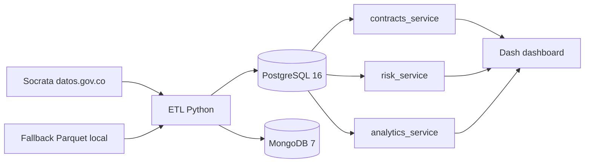

# Transparencia360 / ContratIA Abierta

Sistema poliglota de priorizacion de revision contractual en Colombia para veedurias, oficinas de transparencia y periodistas de datos.

El sistema **no prueba conductas indebidas ni responsabilidad individual**. Ordena procesos de contratacion publica para decidir que revisar primero con evidencia, trazabilidad y explicaciones.

## Problema

Las organizaciones de control social no pueden revisar manualmente miles de procesos SECOP. Transparencia360 convierte datos abiertos oficiales en un ranking explicable de revision humana.

## Datos

- `p6dx-8zbt`: SECOP II Procesos de Contratacion.
- `rpmr-utcd`: SECOP Integrado.
- `9sue-ezhx`: SECOP II Plan Anual de Adquisiciones Detalle.
- `wasc-xi4h`: ejecucion del plan de vigilancia/control fiscal.

La demo usa 10.000+ registros. Si la API Socrata no esta disponible, la carga usa Parquet local existente y falla claramente si tampoco existe.

## Arquitectura



PostgreSQL es la fuente relacional principal. MongoDB guarda snapshots, logs y eventos. FastAPI expone microservicios y Dash es la interfaz oficial.

## Quickstart

```bash
uv sync --python 3.11 --extra dev
cp .env.example .env
make db-up
make db-migrate
make etl-demo
make mongo-load
make validate-final
```

Por defecto Docker publica PostgreSQL en `localhost:55432` y MongoDB en
`localhost:27018` para no chocar con instalaciones locales. Los contenedores siguen
hablando internamente por `postgres:5432` y `mongo:27017`.

Servicios:

```bash
make api
make dashboard
```

Endpoints locales:

- Contracts: `http://localhost:8001/health`
- Risk: `http://localhost:8002/health`
- Analytics: `http://localhost:8003/health`
- Dashboard: `http://localhost:8050`

## Comandos

```bash
make setup
make db-up
make db-migrate
make db-reset
make extract-demo
make build
make score
make etl-demo
make mongo-load
make api
make dashboard
make demo
make test
make lint
make validate-final
```

## Evidencia academica

- 20+ tablas relacionales en `sql/001_schema.sql`.
- Constraints, FK, indices, triggers y vistas analiticas.
- Triggers de auditoria, historial de estado, validacion de score y `updated_at`.
- Window functions y CTE recursiva en `sql/004_views_analytics.sql`.
- Transaccion demo en `sql/006_transactions_demo.sql`.
- Reporte final en `docs/report/reporte_final.md`.
- Manual, plan de pruebas, data dictionary y disclosure de IA en `docs/`.

## Scoring

El scoring mantiene una filosofia interpretable:

- componente de anomalia,
- desviacion frente a pares,
- reglas explicitas,
- score de confianza,
- razones visibles.

La salida es una alerta de prioridad, no una acusacion.

## Limitaciones

- Los datos abiertos pueden tener campos incompletos o cambios de esquema.
- Los enlaces SECOP/PAA no se asumen perfectos.
- El contexto fiscal es visible y no se usa como etiqueta acusatoria.
- La encuesta de usabilidad debe completarse con 5 usuarios reales antes de la entrega final.

## Licencia

Codigo bajo MIT. Los datos provienen de fuentes abiertas oficiales de Colombia y conservan sus condiciones de uso originales.
