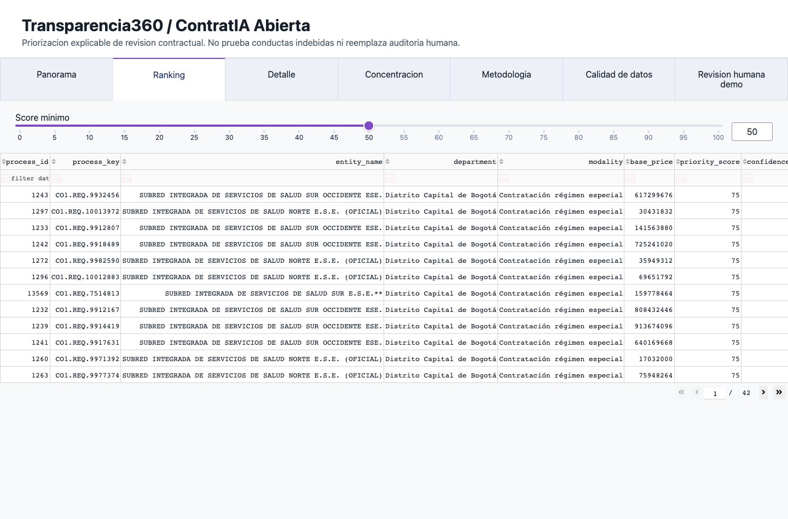
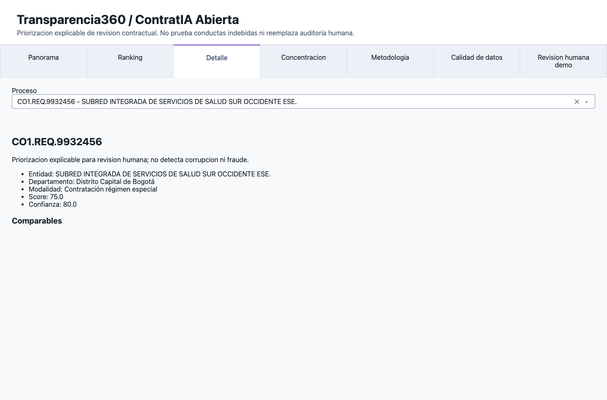
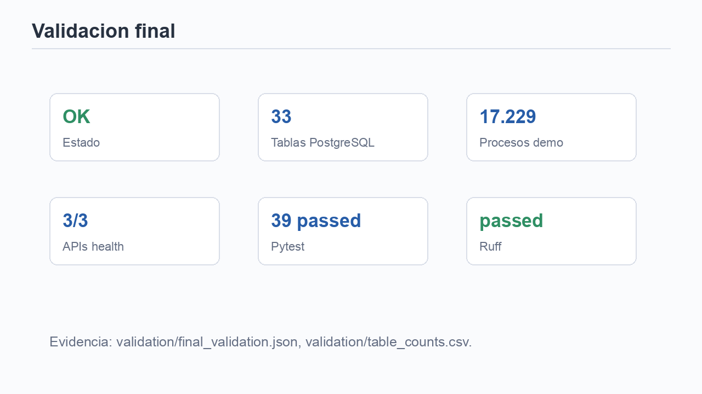

# ContratIA Abierta

ContratIA Abierta is a data-engineering system for Colombian public-procurement
review. It turns open SECOP data into an explainable queue: which processes
should be inspected first, why they were prioritized, and what human review
should happen next.

The system does not accuse, prove corruption, or replace legal or fiscal
auditing. It supports human review with traceable evidence and explicit
limitations.

## Product Preview

| Review queue | Process detail | Validation summary |
| --- | --- | --- |
|  |  |  |

## Architecture

There is one official end-to-end architecture:

```text
Socrata API -> ETL (Polars + Parquet) -> PostgreSQL + MongoDB
            -> FastAPI x3 (contracts, risk, analytics) -> Dash
```

| Component | Detail |
| --- | --- |
| Main command | `make demo-full && make validate-final` |
| UI | Dash dashboard in `dashboard/dash_app.py` |
| Product fallback | Streamlit UI and FastAPI route for offline demos |
| APIs | FastAPI services in `services/*` on ports 8001, 8002, and 8003 |
| Storage | PostgreSQL as relational source of truth; MongoDB for evidence and events |
| Evidence | 90,431 scored processes, AGR validation lift of 2.5x, Puerto Gaitan case study of 3.1x |

`src/app/streamlit_app.py` and `src/api/main.py` remain as an offline product
path, not as a separate product. The scoring code in `src/scoring` and
`src/features` is shared across the full-stack and lean routes.

## Data Sources

- `p6dx-8zbt`: SECOP II procurement processes.
- `rpmr-utcd`: integrated SECOP records.
- `9sue-ezhx`: SECOP II annual procurement-plan detail.
- `wasc-xi4h`: fiscal-control context.

Fiscal-control records are used as contextual evidence, not as labels of
wrongdoing. Their presence or absence does not prove individual responsibility.

## Full-Stack Quickstart

Install dependencies:

```bash
uv sync --python 3.11 --extra dev
```

Run the full academic demo:

```bash
make demo-full
make validate-final
```

Equivalent staged commands:

```bash
make academic-db-up
make academic-db-schema
make academic-etl
make academic-services-up
make academic-demo
make validate-academic
```

Local endpoints:

- Contracts service: `http://localhost:8001/health`
- Risk service: `http://localhost:8002/health`
- Analytics service: `http://localhost:8003/health`
- Dash dashboard: `http://localhost:8050`

`validate-final` requires PostgreSQL, MongoDB, and the services to be running.
If Docker, OrbStack, or the local ports are unavailable, the validation JSON
reports integration blockers instead of declaring a false success.

## Lean Product Route

The lean route creates product artifacts from versioned sample fixtures by
default. It is useful for clean clones, CI, and machines without Docker.

```bash
make product-pipeline
make product-ui
make product-api
```

Use current Socrata data when rebuilding from live open-data sources:

```bash
make product-pipeline PRODUCT_SOURCE_MODE=download
```

Local endpoints:

- Streamlit product UI: `http://localhost:8501`
- FastAPI product API: `http://localhost:8000`
- Product health endpoint: `http://localhost:8000/health`

Validate the lean route:

```bash
make validate-product
```

## Scoring

The priority score combines interpretable signals:

- anomaly component;
- deviation from comparable procurement processes;
- explicit rules;
- data-confidence score;
- visible reason codes.

Text similarity uses TF-IDF and cosine similarity for process-to-plan matching
and comparable-process search. `sentence-transformers` is available as an
optional provider through `CONTRATIA_USE_TRANSFORMER_EMBEDDINGS=1`; CI and local
validation default to TF-IDF to avoid heavyweight downloads.

## Documentation

Core documents:

- `docs/product_route.md`
- `docs/academic_route.md`
- `docs/model-card.md`
- `docs/ethics-note.md`
- `docs/demo-guide.md`
- `docs/demo-casebook.md`
- `docs/validation-summary.md`
- `docs/human_validation_protocol.md`
- `docs/human_validation_results.md`
- `docs/deployment.md`

The public-facing product name used in some deliverables is `Transparencia360`.
The repository name and implementation remain `ContratIA Abierta`.

Human-only work that is intentionally not fabricated:

- UX survey with real users;
- manual validation by reviewers;
- public deployment URL;
- external registry submission if needed.

## Quality

```bash
make lint
make test
make demo-full
make validate-final

# Optional lean route:
make product-pipeline && make validate-product
```

## License

Code is released under MIT. The datasets come from official Colombian open-data
sources and retain their original terms of use.
