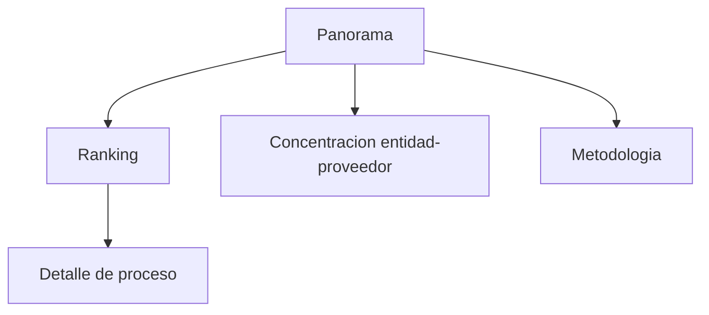

# Manual de usuario

## Instalacion

```bash
uv sync --python 3.11 --extra dev
cp .env.example .env
make db-up
make etl-demo
make mongo-load
make dashboard
```

## Mapa de navegacion



## Funcionalidades

- Ver volumen nacional/demo.
- Filtrar ranking por score.
- Revisar entidades y proveedores concentrados.
- Consultar metodologia y advertencia etica.

## Ejemplo guiado

1. Ejecutar `make dashboard`.
2. Abrir `http://localhost:8050`.
3. Revisar panorama.
4. Ir a Ranking y filtrar por score alto.
5. Usar la informacion como priorizacion de revision humana, no como acusacion.
