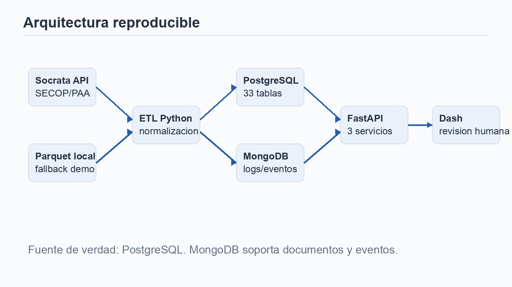
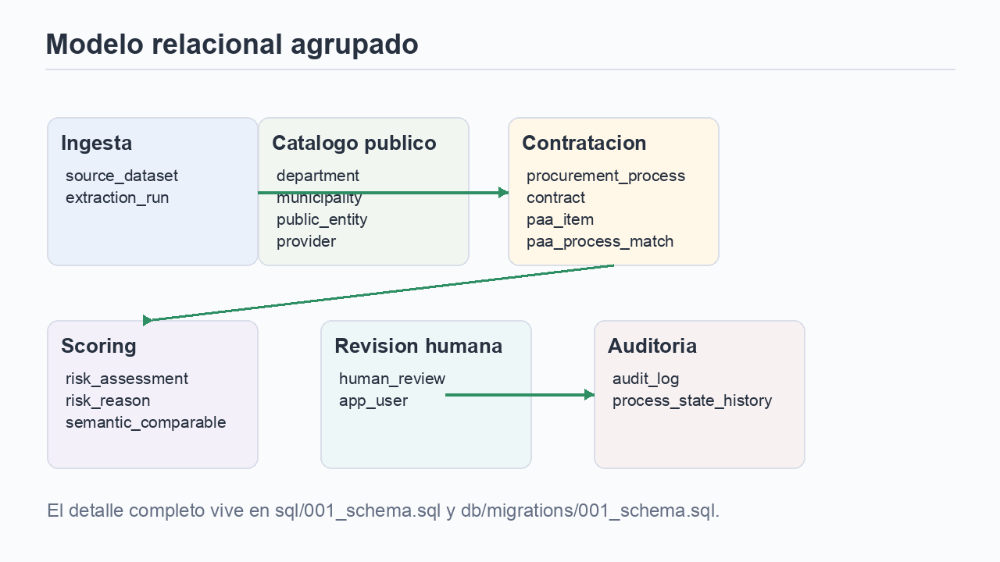
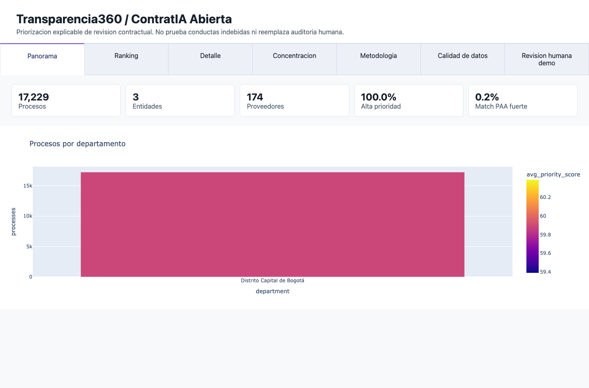
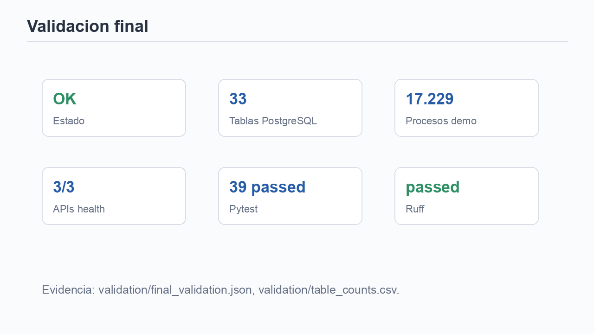

# 1. ContratIA Abierta

Ordenar miles de procesos SECOP para decidir que revisar primero.

**Prioriza revision humana; no prueba conductas indebidas.**

Ingenieria de Datos, Universidad del Rosario.

---

# 2. Problema

No faltan datos de contratacion.

Falta capacidad humana para revisarlos con prioridad, evidencia y trazabilidad.

Muchos procesos -> ranking -> revision humana.

---

# 3. Stakeholder y decision

Veeduria ciudadana

Control interno

Periodista de datos

**Decision semanal:** que procesos revisar primero y por que.

---

# 4. Requisitos cubiertos

PostgreSQL: 27 tablas + vistas

MongoDB: documentos y eventos

FastAPI: 3 servicios

Dash: interfaz oficial

ETL: 17.229 procesos

Tests: 39 pasan

---

# 5. Fuentes y volumen

SECOP II Procesos

SECOP Integrado

Plan Anual de Adquisiciones

Contexto fiscal abierto

Demo validada: 17.229 procesos.

---

# 6. Arquitectura

Socrata -> ETL -> PostgreSQL + MongoDB -> FastAPI -> Dash.

---

# 7. Modelo relacional

PostgreSQL es la fuente de verdad: PK/FK, constraints, indices, vistas y triggers.

---

# 8. NoSQL y auditoria

MongoDB guarda:

snapshots crudos

logs de ETL

eventos de prioridad

reportes

acciones de usuario

---

# 9. SQL engineering

Triggers: auditoria, historial, updated_at.

Window functions: concentracion y outliers.

CTE recursiva: jerarquia territorial.

Transacciones: score + evento atomico.

---

# 10. Score explicable

Reglas primero.

Desviacion frente a pares.

Componente de anomalia.

Confianza de datos.

Razones auditables.

---

# 11. Demo

Panorama -> Ranking -> Detalle -> Comparables.

---

# 12. Validacion y cierre

Limites: datos ruidosos, joins imperfectos, requiere revision humana.

Siguiente: encuesta real con 5 usuarios.
