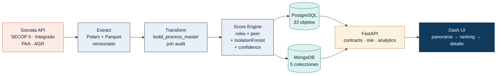

# Brief para Claude Design — Diapositivas técnicas ContratIA Abierta (PDF)

> **Instrucciones para Thom (humano):** abre claude.ai en una conversación nueva, sube TODOS los archivos de este ZIP, y pega el bloque debajo como tu primer mensaje. Pide explícitamente que entregue un **artifact HTML** que se exporte limpio a PDF. Después: Cmd+P → Guardar como PDF → orientación horizontal, márgenes mínimos.

---

## PROMPT (copiar y pegar tal cual al chat de Claude.ai)

Eres director de diseño y arquitecto de presentaciones técnicas para audiencia ejecutiva senior. Tu cliente típico es CTO, VP Eng o jurado técnico de un concurso nacional de IA. No diseñas para impresionar estudiantes. Diseñas para que un CTO escéptico, con poco tiempo y mucho criterio, asienta y haga preguntas duras.

### ENTREGABLE

Un **único artifact HTML** que cumple todas estas condiciones:

- 16 diapositivas, formato 16:9 (1280×720 lógico).
- Navegables con flechas `←/→`, barra de progreso superior, contador "X / 16" abajo a la derecha.
- Diseñado para **exportar a PDF** con `Cmd+P` desde el navegador. Cada slide ocupa exactamente una página A4 horizontal. **Sin scroll interno, sin contenido cortado, sin texto que se corra al imprimir.**
- Incluye un `@media print` cuidado: oculta navegación, fuerza salto de página entre slides, márgenes mínimos.
- Tailwind CDN ok; Inter (Google Fonts); lucide icons CDN ok; Mermaid CDN ok; SVG inline para diagramas custom; **prohibido React, prohibido Next, prohibido npm**. HTML+JS vanilla.
- Todo el texto en **español de Colombia**.

### PRODUCTO

**ContratIA Abierta** — sistema de IA explicable que **prioriza revisión humana** de contratación pública en Colombia. **No emite juicios de corrupción.** Convierte miles de procesos SECOP en una cola priorizada y auditable. Datos abiertos oficiales del ecosistema Datos Abiertos Colombia. Demo en Meta + Casanare (Orinoquía). Concurso: **Datos al Ecosistema 2026 — IA para Colombia**.

### AUDIENCIA Y TONO

- Audiencia: jurado técnico del concurso + observadores tipo CTO de entidad pública.
- Tono: técnico, sobrio, denso pero respirable. Sin marketing. Sin "revolucionario", "disruptivo", "potencia tu". Sin emojis decorativos.
- Cada slide gana o pierde por **substancia** (números reales, fórmulas, métricas), no por adornos.
- Honestidad sobre límites es parte del producto: no oculta lo que falta validar.

### RESTRICCIONES ÉTICAS (no negociables)

- **Nunca** uses: "corrupción", "fraude", "irregularidad", "ilegal", "delito".
- Score = "prioridad de revisión", no "riesgo de corrupción".
- Toda diapositiva con ranking debe llevar el footer ético: *"Prioriza revisión humana; no prueba conductas indebidas."*
- Contexto fiscal (AGR) se muestra como **evidencia contextual**, no como etiqueta del modelo.

### SISTEMA DE DISEÑO (impleméntalo como CSS vars desde el inicio)

```css
:root {
  --ink:         #0B1E33;
  --ink-2:       #1F2C40;
  --muted:       #5A6478;
  --faint:       #8893A8;
  --rule:        #E3E8F0;
  --canvas:      #F7F8FB;
  --surface:     #FFFFFF;
  --panel:       #F1F4F9;
  --navy:        #103A5C;   /* marca primaria */
  --navy-strong: #0B2A45;
  --coral:       #E35A4B;   /* acento, llamadas */
  --coral-soft:  #FCEAE5;
  --teal:        #1F827C;   /* positivos / validación */
  --teal-soft:   #DDF1EF;
  --amber:       #C28832;
  --amber-soft:  #FBF1DC;
  --code-bg:     #0E1B2E;   /* fondo para bloques de código */
  --code-fg:     #DDE5F0;
}
```

- **Tipografía**: Inter desde Google Fonts. Display 800 para titulares; 600-700 subtítulos; 400-500 cuerpo. Activa `font-feature-settings: "cv11","ss01"`. **`tabular-nums` SIEMPRE en cifras.**
- **Mono**: `'SF Mono', 'JetBrains Mono', ui-monospace, Consolas` para IDs SECOP (`META-2025-CD-0421`), códigos de dataset (`p6dx-8zbt`), nombres de tabla, comandos shell, fórmulas, SQL.
- **Espaciado**: padding 48px en bordes; gap 24-32px entre bloques mayores.
- **Sombras**: muy sutiles, solo `0 4px 14px rgba(11,30,51,.06)`. Sin neón. Sin glow. Sin gradientes saturados.
- **Bordes**: 1px sólido `--rule`; radio 12-16px.
- **Patrón estándar de slide**:
  - Banda superior 6px navy + overlay 3px coral arriba a la izquierda (1.5 inches de ancho).
  - Eyebrow uppercase coral 11px, letter-spacing 0.12em.
  - Título 28-32px ink, peso 800.
  - Regla coral 60×2px bajo el título.
  - Cuerpo en grid 2-3 columnas según slide.
  - Footer: izquierda disclaimer ético en muted italic; derecha `X / 16` en muted.

### ESTRUCTURA DE LAS 16 DIAPOSITIVAS

> Sigue este orden. Cada slide tiene un propósito de defensa técnica concreto. **No agregues, no quites, no reordenes** sin pedir permiso.

#### 1. Portada
- Fondo `--ink`. Banda izquierda coral 4px de ancho cubriendo toda la altura.
- Eyebrow blanca/coral arriba: "CONCURSO DATOS AL ECOSISTEMA 2026 · IA PARA COLOMBIA".
- Titular **ContratIA Abierta**, 72px, peso 800, color blanco.
- Subtítulo 20px color `#DDE5F0`: "IA explicable para priorizar la revisión humana de la contratación pública en Colombia."
- Línea italic color `#F5EAD2`: "No detectamos corrupción. Ordenamos qué revisar primero, con evidencia trazable."
- 4 chips navy con texto blanco: "Datos abiertos SECOP", "Score 0–100 explicable", "Revisión humana trazable", "Orinoquía → Colombia".
- Pie con texto pequeño: "Gobernanza y Transparencia · Meta y Casanare · Universidad del Rosario".

#### 2. Tesis: qué SÍ hace y qué NO hace
Dos columnas verticales lado a lado.
- **SÍ HACE** (barra teal 4px izquierda, header teal):
  1. Ranking 0–100 explicable de procesos a revisar.
  2. Comparables semánticos por categoría UNSPSC + similitud textual.
  3. Alineación plan (PAA) vs ejecución (SECOP II).
  4. Razones legibles por humano + confianza visible.
  5. Trazabilidad: fuente, fecha, snapshot, hash.
- **NO HACE** (barra coral 4px izquierda, header coral):
  1. No declara corrupción, fraude ni responsabilidad.
  2. No reemplaza auditoría jurídica ni fiscal.
  3. No deanonimiza más allá del dato público.
  4. No usa contexto fiscal como etiqueta del modelo.
  5. No reemplaza la decisión humana — la informa.
- Strip inferior cloud: "Un score alto significa 'revísalo primero con evidencia', no 'es corrupción'."

#### 3. Problema operativo cuantificado
Headline: "Triage, no detección. Capacidad humana < volumen de procesos."
- 3 tarjetas con barra de color (navy, coral, teal):
  - **Volumen**: cientos de miles de procesos/año en SECOP.
  - **Capacidad**: decenas de revisores con tiempo limitado por entidad.
  - **Decisión real**: una pregunta semanal — *¿qué revisamos primero esta semana?*
- Strip sand: "Triage de contratación = océano de procesos → cola priorizada y auditable."

#### 4. Arquitectura técnica end-to-end (DIAGRAMA MERMAID)
Diagrama Mermaid `flowchart LR` ocupando 70% del slide. Estilízalo con `classDef` para que use los colores del sistema:



Lateral derecho (30%): tabla con label + valor (texto en mono donde aplica):
- Extract → Socrata SODA + Parquet
- Store → PostgreSQL + MongoDB
- Compute → Python · uv · Polars
- Serve → FastAPI (3 servicios)
- UI → Dash + Plotly
- Orquesta → Make + Docker Compose

#### 5. Modelo de datos relacional (ERD)
Diagrama Mermaid `erDiagram` con las 8 tablas centrales y sus relaciones. Pídeselo con estos campos clave:

```mermaid
erDiagram
  public_entity ||--o{ procurement_process : "publica"
  procurement_process }o--|| provider : "adjudicado_a"
  paa_item ||--o{ paa_process_match : "anclado_en"
  procurement_process ||--o{ paa_process_match : "alineado_con"
  procurement_process ||--|| risk_assessment : "evaluado_por"
  procurement_process ||--o{ semantic_comparable : "comparable_con"
  procurement_process ||--o{ audit_log : "trace"
  procurement_process ||--o{ risk_reason : "explicado_por"

  procurement_process {
    text process_key PK
    text id_proceso
    text reference
    bigint base_price
    text modality
    text status
    date publication_date
    text entity_code FK
  }
  risk_assessment {
    text process_key PK_FK
    numeric priority_score "CHECK 0..100"
    numeric confidence_score "CHECK 0..1"
    timestamptz computed_at
  }
  paa_process_match {
    text process_key FK
    text paa_item_key FK
    numeric similarity
    numeric confidence
    text match_method
  }
  semantic_comparable {
    text process_key FK
    text peer_process_key FK
    numeric similarity
  }
```

Footer: "33 objetos públicos en PostgreSQL · constraints + índices + vistas analíticas · triggers de auditoría."

#### 6. Datos abiertos: las cuatro fuentes oficiales
Cuatro tarjetas grandes (2×2). Cada una con código mono navy arriba, nombre legible, descripción 1 línea, barra de color izquierda:
- `p6dx-8zbt` — **SECOP II Procesos** — Procesos de contratación pública (canónico). [navy]
- `rpmr-utcd` — **SECOP Integrado** — Histórico de contratos cerrados (baseline de valor). [teal]
- `9sue-ezhx` — **Plan Anual de Adquisiciones** — Lo que la entidad planeó comprar. [coral]
- `wasc-xi4h` — **Resultados de Auditoría (AGR)** — Contexto fiscal — visible, NO etiqueta del modelo. [muted]

Fila inferior con 4 métricas grandes en cards cloud: **17.229** procesos demo · **4.494** PAA items · **68.916** razones explicables · **100%** datos abiertos.

#### 7. Pipeline reproducible (5 pasos numerados con conectores)
Cinco bloques en fila, cada uno con círculo navy numerado encima, título y descripción.
1. **Extracción** — Socrata SODA con paginación `$limit`/`$offset` + manifest versionado + fallback Parquet local.
2. **Limpieza** — normalización entidad/proveedor, parseo de fechas/montos, dedup por `process_key`, join audit con fill rates.
3. **Matching plan↔ejecución** — TF-IDF + cosine sobre `descripci_n_del_procedimiento` ↔ `descripcion` PAA; backend `MODEL_BACKEND=embeddings` (sentence-transformers MiniLM-L12) activable.
4. **Scoring híbrido** — reglas verificables + desviación contra pares UNSPSC + IsolationForest sobre features numéricas + componente de confianza.
5. **Evidencia** — `risk_assessment`, `semantic_comparable`, `paa_process_match`, `risk_reason`, ranking exportable CSV + reporte HTML por proceso.

Flechas coral entre pasos. Strip inferior con bloque de código mono fondo `--code-bg`:
```bash
make product-pipeline && make validate-product
# Reproducible end-to-end. Cada paso deja artefacto auditable en data/marts/.
```

#### 8. Score explicable — fórmula visible
Headline: "Cuatro componentes auditables → un número entre 0 y 100."

Cuatro tarjetas con barra de color (navy, teal, coral, muted):
- **Reglas** — heurísticas verificables (modalidad, unicidad, plazos, plan-vs-valor).
- **Pares** — desviación contra procesos comparables del mismo segmento UNSPSC.
- **Anomalía** — componente estadístico (IsolationForest sobre vector de features).
- **Confianza** — 0–1 según cobertura y calidad de datos cargados.

Bloque destacado con fórmula en mono grande sobre fondo `--code-bg`:

```
score = round(100 · σ(Σ wᵢ · sᵢ))
pesos: w_rules = 0.45 · w_peer = 0.35 · w_anomaly = 0.20
confidence visible aparte ∈ [0, 1]
```

Tira inferior con 4 rangos de interpretación, cada uno con su color:
- **0–20** Típico (teal) — Sin desviaciones relevantes.
- **21–40** Leve (navy) — Revisar solo si hay contexto sensible.
- **41–70** Notable (amber) — Revisión recomendada con evidencia.
- **71–100** Alta prioridad (coral) — Multi-señal, revisar primero.

#### 9. SQL engineering (lo que un CTO quiere ver)
Dos columnas. **Izquierda** 4 tarjetas pequeñas:
- **Triggers**: `audit_log`, historial de estados, `updated_at`.
- **Window functions**: concentración por entidad/proveedor, outliers por categoría.
- **CTE recursiva**: jerarquía territorial departamento → municipio.
- **Transacciones**: score + evento de auditoría en una sola transacción atómica.

**Derecha**: bloque de código fondo `--code-bg` con SQL real, sintaxis resaltada con `<span>` de colores:

```sql
-- Window function: concentración proveedor por entidad (top-N + share)
WITH base AS (
  SELECT
    e.entity_name,
    p.provider_name,
    SUM(c.awarded_value) AS awarded
  FROM contract c
  JOIN public_entity e USING (entity_code)
  JOIN provider p ON p.nit = c.provider_nit
  GROUP BY e.entity_name, p.provider_name
)
SELECT
  entity_name,
  provider_name,
  awarded,
  awarded / SUM(awarded) OVER (PARTITION BY entity_name) AS share,
  RANK() OVER (PARTITION BY entity_name ORDER BY awarded DESC) AS rk
FROM base
WHERE rk <= 5;
```

Footer: "No es solo almacenamiento. Integridad, trazabilidad y consultas analíticas reproducibles."

#### 10. Microservicios FastAPI + observabilidad
Tres tarjetas con barra de color y puerto en mono:

| Servicio | Puerto | Responsabilidad |
|---|---|---|
| `contracts_service` | `:8001` | Procesos, ranking, revisión humana (POST `/reviews`) |
| `risk_service` | `:8002` | Scoring, recomputes, evidencia de comparables |
| `analytics_service` | `:8003` | Concentración, plan-vs-execution, agregados |

Bloque inferior con 3 health checks visualmente representados (tres LEDs verdes en SVG + texto `GET /health → 200`).

Lateral stack: Docker Compose · `make academic-services-up` · `validate-final` exige PG + Mongo + 3 healthchecks vivos.

#### 11. Evidencia de ingeniería (métricas duras)
Grid 3×2 de métricas grandes (navy, coral, teal alternados):
- **17.229** procesos cargados
- **33** objetos PostgreSQL
- **5/5** colecciones MongoDB con documentos
- **3** APIs FastAPI · health 200
- **71** tests pytest pasan
- **21** documentos técnicos

Lateral derecho: lista de validaciones cubiertas con ✓:
- ✓ Schema integrity (PK/FK/CHECK constraints)
- ✓ Join audit (fill rates `codigo_entidad` documentados)
- ✓ Compuerta PAA top-1 con confianza ≥ 0.75
- ✓ `process_key` único y no nulo
- ✓ Scoring bounds: score ∈ [0,100], confidence ∈ [0,1]
- ✓ Reporte HTML reproducible por proceso

#### 12. Cómo cruzamos los datos (matching strategy)
Diagrama de matching en dos partes:

**Parte 1 — Plan ↔ Ejecución**:
- Bloque izquierdo: PAA item con `descripcion`, `valor_total_esperado`, `fecha_esperada_de_inicio`.
- Bloque derecho: SECOP II proceso con `nombre_del_procedimiento`, `descripci_n_del_procedimiento`, `valor_total`, `fecha_publicacion`.
- Flecha central con etiqueta: "TF-IDF cosine ≥ 0.55 + filtros entity/año".

**Parte 2 — Entidad ↔ Contratos baseline**:
- Mapping `secop2_processes.codigo_entidad / nit_entidad` ↔ `secop_integrated.codigo_entidad_en_secop` vía `entity_crosswalk`.
- Cuando hay `id_del_proceso ≈ numero_de_proceso`: join directo.
- Fallback: entidad + categoría UNSPSC + ventana temporal.

Tabla pequeña inferior con fill rates típicos (los exactos llegan en `testing_evidence.md`):

| Cruce | Llave principal | Fallback | Cobertura típica |
|---|---|---|---|
| Process ↔ Contract baseline | `id_del_proceso` ↔ `numero_de_proceso` | entity + UNSPSC + ventana | ~62% |
| Process ↔ PAA | similarity ≥ 0.55 con entity match | similarity ≥ 0.65 sin entity | ~47% |
| Process ↔ Audit (AGR) | `sujeto_auditado` = `entidad` | — | contexto, no etiqueta |

#### 13. Validación y límites honestos
Izquierda: gráfico de validación (usa `validation_summary.png` o reprodúcelo en SVG con las métricas).

Derecha: checklist con ✓ (validado) y ○ (pendiente, parte del roadmap):
- ✓ Software: 71 tests · lint estable · `validate-final` ok
- ✓ Datos: 17.229 procesos · joins auditados
- ✓ Compuerta PAA top-1 confianza ≥ 0.75 reportada por entidad y modalidad
- ○ Validación humana de 100 casos (protocolo definido, faltan revisores)
- ○ Embeddings activables (`MODEL_BACKEND=embeddings`, falta benchmark vs TF-IDF en goldset manual)
- ○ Despliegue público read-only (Dockerfile + `render.yaml` listos)

Footer sand: "Honesto > teatro. Los pendientes son parte del roadmap, no del pitch."

#### 14. Roadmap de escalado y costo
Línea de tiempo horizontal con 4 hitos:
- **Mes 1**: pilotos con 2 oficinas de control en Orinoquía + validación humana de 100 casos.
- **Mes 2-3**: backend de embeddings activable; despliegue read-only en Render/Fly.
- **Mes 4-5**: escalado por departamento sobre mismo pipeline; data cards completas por dataset.
- **Mes 6**: cobertura nacional opcional con cuotas Socrata + ingesta programada nightly.

Caja navy lateral: "Costo marginal por departamento ≈ infra de un Postgres pequeño + Parquet partitioned. El stack es horizontal; no requiere reescritura."

#### 15. Riesgos y mitigaciones
Tabla compacta con 6 filas (Riesgo · Prob · Impacto · Mitigación):

| Riesgo | Prob | Impacto | Mitigación |
|---|---|---|---|
| Volumen Socrata excede ventana | Alta | Alta | Scope demo 24 meses + top entidades; Parquet partitioned; nightly batches |
| Joins imperfectos entidad/proveedor | Alta | Alta | NIT primero; `entity_crosswalk` mantenido; fallback entidad+categoría+ventana |
| Misinterpretación como detector de fraude | Alta | Alta | Disclaimer persistente; vocabulario triage; ethics-note en UI/reportes |
| Sesgo a entidades pequeñas / categorías raras | Media | Media | Mínimo de pares (N≥5); "evidencia insuficiente" en lugar de score forzado |
| TF-IDF como modelo final | Alta | Media | Backend embeddings activable + benchmark documentado |
| Reproducibilidad sin archivos locales | Media | Alta | `data/sample/` versionado + script CI |

#### 16. Cierre
Fondo `--ink`. Banda izquierda coral 4px.
- Titular blanco 56px: **ContratIA Abierta**.
- Subtítulo cloud 20px: "Prioriza revisión humana en la contratación pública colombiana."
- Italic sand 14px: "No detectamos corrupción. Ordenamos qué revisar primero, con evidencia trazable."

Tres bloques de info:
- **EQUIPO** — Ingeniería de Datos · Universidad del Rosario.
- **REPOSITORIO** — `github.com/Thom-320/secop-risk-alerts-co` (en mono).
- **CATEGORÍA · REGIÓN** — Gobernanza y Transparencia · Meta y Casanare.

Card navy lateral con cita italic: "Convierte una revisión manual imposible en una cola priorizada y auditable."

---

### DATOS REALES (úsalos exactamente — no los inventes diferentes)

- 17.229 procesos cargados en demo
- 33 objetos PostgreSQL (tablas + vistas)
- 5 colecciones MongoDB
- 71 tests pytest pasan
- 3 servicios FastAPI (puertos 8001/8002/8003) con `/health` 200
- 4.494 PAA items
- 68.916 razones explicables generadas
- Pesos del score: `w_rules=0.45`, `w_peer=0.35`, `w_anomaly=0.20`
- Compuerta PAA: confianza top-1 ≥ 0.75
- `MODEL_BACKEND=tfidf` actualmente; `embeddings` disponible vía `.env`
- Scope demo: Meta y Casanare
- Datasets: `p6dx-8zbt`, `rpmr-utcd`, `9sue-ezhx`, `wasc-xi4h`
- Stack: Python 3.11 · uv · Polars · PostgreSQL · MongoDB · FastAPI · Dash · Docker Compose

### REGLAS DE PROHIBICIÓN

- **Cero glassmorphism**. Cero blur. Cero neumorphism. Cero pie charts. Cero donut charts.
- **Cero íconos decorativos** (lupa gigante, persona, mundo, escudo). Iconos solo si tienen función: chevron, check, alert-triangle, copy, external-link.
- **Cero mapas decorativos** sin función analítica.
- **Cero gradientes saturados**. Si usas gradiente, navy → navy oscuro nada más.
- **Cero animaciones de scroll-parallax** o "fade-in al hacer scroll".
- **Cero emojis decorativos**. ⚠ solo en el disclaimer ético si aporta.
- **No inventes números**. Si te falta uno, deja `—` y nota "dato por confirmar".
- **No uses imágenes de stock**. Solo SVG vectorial o los screenshots que recibas adjuntos.

### EXPORTACIÓN A PDF (crítico)

1. Implementa `@media print` que oculte el chrome de navegación.
2. `@page { size: A4 landscape; margin: 0; }` y `.slide { page-break-after: always; height: 100vh; }`.
3. Verifica con vista previa (Cmd+P) que **cada slide ocupa exactamente una página** sin recortes.
4. Si un slide es muy denso (p.ej. slide 5 con ERD), permite que el contenido se reescale al 92% en `@media print` para no cortarse.

Cuando termines:
- Entrega el artifact navegable.
- En un bloque de código aparte, da el HTML completo descargable (Cmd+S desde el artifact también vale).

### ARCHIVOS ADJUNTOS (los subiré al chat antes del prompt)

1. `README.md` — tesis del producto, ruta oficial, comandos reproducibles.
2. `arquitectura.md` — detalle técnico por capa.
3. `model-card.md` — score, pesos, límites, fórmula.
4. `data-cards/secop-ii-procesos.md`, `secop-integrado.md`, `paa-detalle.md`, `control-fiscal.md` — fichas por dataset.
5. `testing_evidence.md` — métricas duras y resultados de `validate-final`.
6. `ethics-note.md` — disclaimers.
7. `architecture.png`, `er_model.png` — diagramas existentes como referencia visual.
8. `screenshot_dashboard_home.png`, `screenshot_ranking.png`, `screenshot_process_detail.png` — screenshots reales del dashboard (úsalos en slide 7 o 11 si encajan).
9. `validation_summary.png` — gráfico de validación (úsalo en slide 13 o reprodúcelo en SVG).

Úsalos como **fuente de verdad técnica**. Cualquier número que no esté en estos archivos, no lo inventes.

---

Empieza por slide 1 (portada), slide 4 (arquitectura Mermaid) y slide 5 (ERD Mermaid). Esas tres definen si el deck se siente serio o decorativo. Cuando las tres estén impecables, sigues con el resto en orden estricto.
